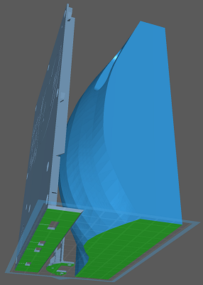
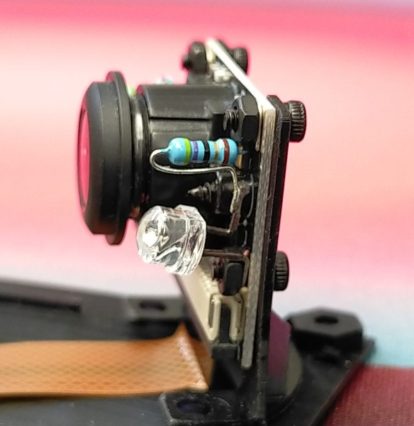
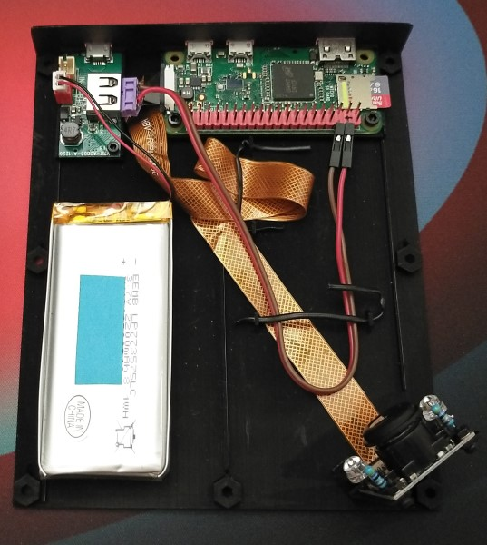
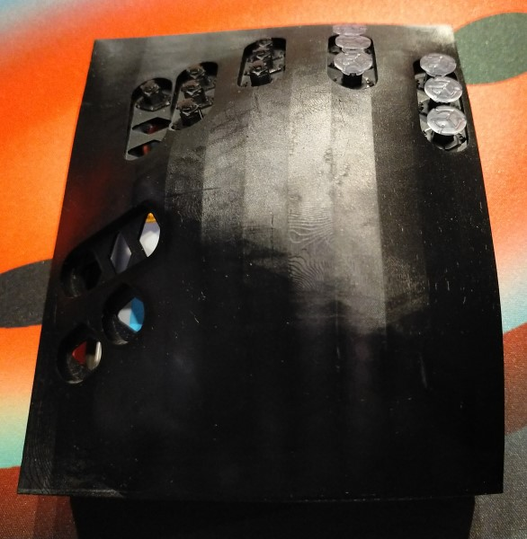

Wotafk40 Hardware
=================

(c) 2022 ムムム製作所

Wotafk40キーボードのハードウェア製作に必要なSTLファイルのリポジトリです。
まだ
[Wotafk40_Intro](https://github.com/mumumufactory/Wotafk40_Intro)
のREADMEをご覧になっていない場合は、まずそちらをご覧ください。

ファイルの説明
--------------

### `EnclosureTop_hb.stl`

筐体の上部のSTLファイルです。スイッチの挿入孔が20箇所開いています。
STLそのものは右手用なのですが、
CHITUBOX等でプリンタ用のファイルに変換する際に反転させることで、
左手用の筐体上部をプリントできます。そういう意味で左右兼用です(以下「左右兼用」はこの意味で使います)。
ヘリンボーン模様を表面に刻んでいるつもりなのですが、プリントされた実物では分かりづらいです。

### `EnclosureTop_mu.stl`

これも筐体の上部のSTLファイルなのですが、
上記のヘリンボーン模様の代わりにムムム印がいっぱい刻まれている、アクの強いバージョンです。
構造的には左右兼用ではあるのですが、
元々が左手用に模様付けしたものなので、
反転せずにそのまま右手用としてプリントすると「ムムム」が「マママ」になってしまう、
というバグがあります。

### `EnclosureBottom_Right.stl`

筐体の下部のSTLファイルです。右手専用です。
プリント時の変形を抑えるために背びれ状の支えが3列付いてますので、
プリント後に折り取って捨ててください。

### `EnclosureBottom_MirroredLeft.stl`

筐体の下部のSTLファイルです。左手専用です。
CHITUBOX等でプリンタ用のファイルに変換する際に反転させてください。

### `CameraStay.stl`

カメラステイのSTLファイルです。左右兼用です。
台座部分に出島のような部分が付いていますが、
これはプリント後にばね鋼板から剥がす時にスクレーパーを差し込み易くする為のものです。
ばね鋼板から剥がせたらこの出島は不要なので切り取ってください。
(カメラステイは小さめな部品なので、ばね鋼板を曲げるだけでは剥がれてくれないのです。)

### [`Switch/`](Switch)

スイッチ関連のファイルはこのサブディレクトリにまとめています。
スイッチの製作についてはそちらのREADMEを参照してください。

ハードウェア製作に必要な材料
----------------------------

Wotafk40キーボードのハードウェア製作には、次の表の材料が必要です。
(スイッチの製作には他に必要なものがあります。Switchサブディレクトリの方を参照してください。)

なお、数量は左右分割の両手分です。
PoCとしてなら左右片方だけ作成するのでも良いと思いますので、
その場合は半分の数量の用意でOKです。
左手部分と右手部分は位置関係が反転しているくらいの違いで、
ハードウェアとしてはその他の違いはありません(ソフトウェアも左右同じです)。
実は左右の連携は一切サボっており、左右それぞれ独立したキーボードとなります。
それぞれ別個にホストPCとUSBで接続し、ホストPCからは2台のキーボードとして見えます。
Introリポジトリでも説明した通り、Wotafk40はキーボードとしての実用性はまだまだですので、
一気に左右両方作らずにまずは片方作って様子を見るのも良いアプローチです。

| 種類   | 詳細                          |数量(両手分)|備考 
|--------|-------------------------------|:------:|----
|レジン  | MSLAプリンタ用UVレジン(黒色)  |500g以上|補足1
|SBC     | Raspberry Pi Zero W           | 2      |補足2
|カメラ  | Raspberry Pi用カメラ(160度FoV)| 2      |補足3
|ケーブル| Pi Zero用カメラケーブル >15cm | 2      |長さ15㎝が一般的ですが、それだとちょっと短いです。
|LED     | 赤外発光ダイオード  | 4  |入手困難であれば赤色LEDでも大丈夫です(多分)。
|抵抗    | 固定抵抗器(1/4W程度)| 4  |上記LEDと直列接続して3.3Vを印加した際に適切な電流となる抵抗値としてください。
|ビス    | DIN912 M2.0 x 5mm   | 10 |カメラステイへのカメラの固定と、筐体下部へのカメラステイの仮固定に使用。
|ビス    | DIN912 M2.5 x 5mm   | 18 |筐体の上部と下部の固定と、筐体下部へのPi Zeroの固定に使用。
|ナット  | DIN934 M2.0         | 10 |
|ナット  | DIN934 M2.5         | 18 |
|ゴム足  | 粘着タイプのゴム足  | 8  |筐体下部の四隅に貼って、机の傷を防ぎます。動作に必須ではないです。

#### 補足1: MSLAプリンタ用UVレジン(黒色)

使用するMSLAプリンタに適合するUVレジン。
量としては500gもあれば一通りの試作は出来ますが、
どれだけ試行錯誤を繰り返すかにより最終的に必要な量は変わってきます。

レジンの色は不透明の黒色があればそれを。
Wotafk40の筐体だけでなく、スイッチを含めて全てこの色のレジンを使います。
これは外部からの光が筐体等を透過してカメラに差し込んでノイズとなるのを防ぐためです。
開発者は
[SIRAYA Fast](https://siraya.tech/products/fast-abs-like-grey)
の特性が気に入っているのですが、
黒色はSmoky Black (半透明の黒)しかなくて遮光性が良くないので、
それに黒色顔料を添加して使っています。

#### 補足2: Raspberry Pi Zero W

カメラからの画像データを解析して、
PCから見てキーボードとして扱えるような信号に変換する処理を行うロジックボードとして、
Raspberry Pi Zero Wを使っています。
Wotafk40は左右分割キーボードですので、左右それぞれに1個、合わせて2個必要です。

すでに後継のZero 2 Wも販売されていますが、
PoCとしてはそこまでの処理能力は必要ないので、Zero Wでも十分です。
カメラを高解像度にしたり、フレームレートを上げたりするには
Zero 2が必要になるかもしれませんが、同時に熱対策も必要になりそうですね。

これを書いている2022年終盤の時点では、
半導体不足の影響でZero 2 WだけでなくZero Wまで入手困難な状況ですが、
2023年の第2四半期には
[回復見込み](https://www.raspberrypi.com/news/supply-chain-update-its-good-news/)
だそうです。

#### 補足3: Raspberry Pi用カメラ (160度FoV)

Wotafk40の筐体内でスイッチの動きを撮影するためのカメラ。
これも2個必要です。
必要な諸元としては、

* Raspberry PiとCSIインタフェースで接続できる
* 160度FoVの魚眼レンズ (全てのスイッチを画角に収めるため)
* 基板サイズ25mm x 24mm (それ以上大きいとカメラステイに乗りませんし、筐体に入りません)
* 基板四隅のネジ穴に3.3Vが来ている (LEDを繋げて照明するため)

具体的な商品としては(2つは多分同一のものではないかと思います)、

* [Spotpear - Raspberry Pi Camera 160,5 megapixel OV5647](https://www.spotpear.com/index/product/detail/id/222.html)
* [Waveshare - RPi Camera (G), Fisheye Lens](https://www.waveshare.com/product/raspberry-pi/cameras/5m-pixels/rpi-camera-g.htm)

などが、いろんなショップで入手できると思います。

ハードウェア製作の手順
----------------------

### MSLAプリンタでSTLファイルをプリント

筐体上部、筐体下部、カメラステイのSTLファイルをプリントします。
プリンタにも依りますが、多分その3つを同時にプリントできると思います(下図)。
ばね鋼板を使って、図のようにサポートを使わずにベタ付けでプリントすることを前提としています。

なお、左手用にプリントする際には、CHITUBOX等でプリンタ用のファイルに変換する際に反転させてください。
これは左手専用の`EnclosureBottom_MirroredLeft.stl`も同じです。
(3D CADにミラー機能があれば、反転不要の左手用のSTLも作ったのですが、
DesignSpark Mechanicalにはミラー機能が無いので苦肉の策です。)

### Piカメラをカメラステイに取り付ける。同時にLEDを左右にビスで共締め

プリントしたカメラステイにPiカメラを載せて、4本のDIN912 M2.0とナットM2.0とで四隅を留めるのですが、
その時にLEDと電流制限抵抗を直列につないだもの2つを共締めします。
Piカメラのネジ穴には3.3ボルトが来ていますので、それでLEDを光らせて、筐体内を照らす次第です。
LEDには極性があり、ネジ穴は3V3とGNDが対角線上に配置されてますので、向きに気をつけてください。

LEDと電流制限抵抗とは下図では脚同士を空中で半田付けしています。
半田付けが必要なのはこの部分だけなので、抵抗とLEDの脚をひねって繋ぐとか上手くできれば、
半田ごて無しでもWotafk40を作れます。

### カメラステイとPi Zero Wとを筐体下部に取り付ける

カメラステイ上のPiカメラにカメラケーブルを接続してから、
プリントした筐体下部の隅のあたり(上図参照)に、
カメラステイを1本のDIN912 M2.0とナットとで仮固定します。
(仮固定というのは、すべてのスイッチが画角に入るように向きを微調整した後に、
接着剤で本格的に固定することを想定しているためです。
仮固定用なので、DIN912の頭が筐体下部の裏に飛び出したままですので、机等を傷つけないように注意してください。)

次に、Pi Zero Wを筐体下部に2本のDIN912 M2.5とナットとで取り付けます。

そして、Pi Zero WのCSIポートにカメラケーブルのもう一端を接続します。

下図はここまでの実装が完了した筐体下部です。
カメラケーブルに30cm長のを使っているので、余りまくって折りたたんでいます。

(左上の小さい基板は充放電制御用で、カメラケーブルはそちらにではなく、
その右のPi Zero Wに繋がってます。分かりにくくてすいません。
この充放電基板と左下のLiPo充電池はどちらもWotafk40に必須ではありません。
このドキュメントでもこれ以上は言及しません。)

### 筐体上部を筐体下部に取り付ける

プリントした筐体上部を筐体下部に被せて、最大7本のDIN912 M2.5とナットとで取り付けます。
筐体上部にポケット状のナットホルダーを設けていますので、そこにナットを入れておいて、
筐体下部からDIN912を挿してネジ止めする感じです。
筐体のプリント結果が多少変形していてもネジ止めで矯正できるように、
7箇所と少々多めのネジ止め箇所を設けていますが、
変形が小さくて合わせ目に大きな隙間が無いのなら、3か所くらいのネジ止めでもOKです。

お好みでゴム足を筐体下部の四隅に貼れば、机が傷つくのを防止できます。

### スイッチを筐体上部に取り付ける

別途製作したスイッチを、片手分につき20個、筐体上部の挿入孔に挿し込んで取り付けます。
挿し込むだけです。電気的配線とかは不要です。
スイッチの製作については、Switchサブディレクトリの方を参照してください。

下図はスイッチをいくつか取り付けた途中の状態です。

以上でWotafk40キーボードはハードウェアとしては完成です。
