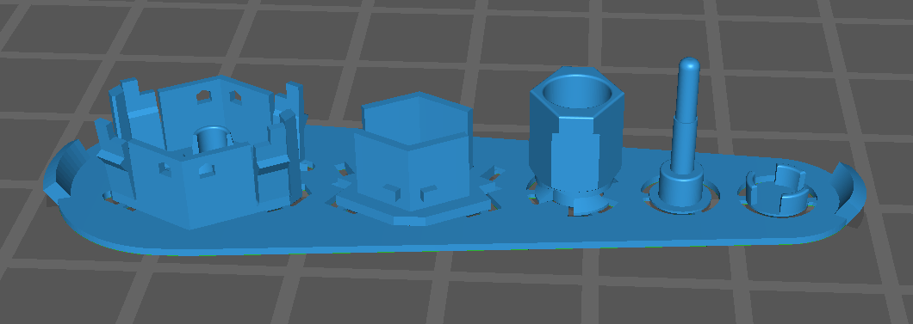
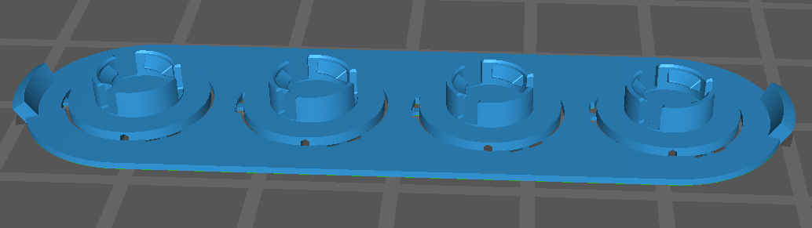
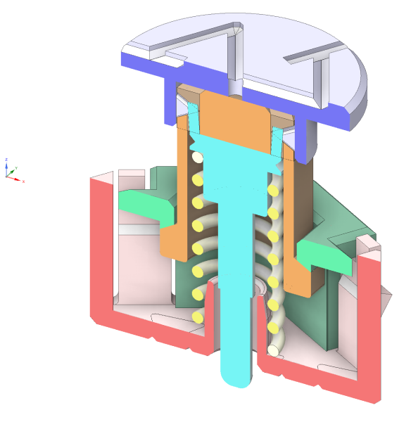
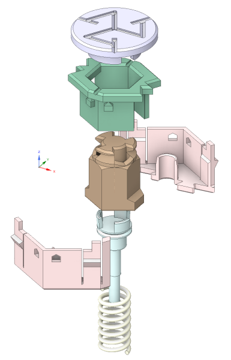

Wotafk40 Switch
===============

(c) 2022 ムムム製作所

Wotafk40キーボードの光学スイッチの製作に関するディレクトリです。
1つ上のディレクトリのREADMEを読んでおいてください。

ファイルの説明
--------------

### `Switch_carrot.stl`

Wotafk40キーボードのスイッチの製作に必要なSTLファイルです。
スイッチ1つに必要な細かい部品6つのセットになりますので、
プリント後の収穫や洗浄、ポストキュア時の取り扱いを容易にするために、
個々の部品をプラモデルでいうランナーで繋げています。
このランナーの形状がそれに似ているので、「人参」と呼んでいます。

### `Keycap_x4.stl`

キーキャップのSTLファイルです。
キーキャップ4個をランナーでまとめています。
キーキャップもスイッチの他の部品とともに上記「人参」にまとめるつもりだったのですが、
キーキャップだけは黒以外の色のレジンでプリントしてもよいかと考え直し、「人参」からは分離しました。
なおキートップの刻印はムムム印だけです。アクが強くてすいません。

スイッチ製作に必要な材料
------------------------

Wotafk40キーボードのスイッチ製作には、次の表の材料が必要です。
数量はスイッチ1個あたりです。

| 種類   | 詳細                          |数量|備考 
|--------|-------------------------------|:--:|----
|レジン  | MSLAプリンタ用UVレジン(黒色)  |適量|「人参」のプリント用。
|レジン  | MSLAプリンタ用UVレジン(任意色)|適量|キーキャップのプリント用。黒色でもOK。
|ばね    | MX互換スイッチ用スプリング    | 1  |補足1
|白ペン  | ペイントマーカー(白色)        |適量|補足2
|テープ  | メンディングテープ            |適量|補足3
|鉛筆    | 鉛筆(黒鉛含有率の高いもの)    |適量|補足4

#### 補足1: MX互換スイッチ用スプリング

MXスイッチの部品交換用に市販されているコイルスプリングです。
スイッチ1個にスプリング1個使います。
どのくらいの反発力のものを選ぶかについては、
「35g」と表示されているものを基準にしてください。
WotafkのスイッチはMXよりスプリングを圧縮気味に使っているので、
35gのスプリングでMXの50g程度の感触になると思います(測定していないので、感覚的なものですが)。

#### 補足2: ペイントマーカー(白色)

軸の先端部を白塗りするのに使います。
開発者はプラチナ万年筆社のペイントマーカー中字を用いています。
これ1本でスイッチ数十個作れると思います。

#### 補足3: メンディングテープ

貼ると目立たなくなる、テープの上から字が書ける、文房具としてとっても著名な、あのテープです。
スイッチの摺動部に貼って摩擦を減らす目的で使います。
PTFEテープとか、UHMWPEテープとかも試したのですが、
このテープに黒鉛を塗布(鉛筆で黒く塗る)した方が上手く行ったりしたので。入手も容易ですし。
スイッチ1個あたり、5mm角の小片を4枚を切り出して使いますので、大抵のテープ幅のもので大丈夫ですが、
開発者は3M社のCM-18という、18mm幅 x 7.6m長のものを使ってます。
その1巻でスイッチ40個は余裕で作れると思います。

#### 補足4: 鉛筆(黒鉛含有率の高いもの)

上記のメンディングテープに黒鉛を塗布するために使います。
黒鉛の含有率が高いほうが目的に適いますので、HBよりB、Bより2B、3B、…の方が良いかと思います。
開発者は三菱鉛筆社のHi-uni 10Bを使っています。
1本あればスイッチ40個は余裕で作れると思います。

スイッチ製作の手順
------------------

### MSLAプリンタでSTLファイルをプリント

「人参」とキーキャップのSTLファイルをプリントします。
サポートを使わずにベタ付けでプリントすることを前提としています。

プリントしたら、ランナーから部品を外します。

### 軸の先端部を白塗りする

上の人参の図の右から2つ目の部品(棒状の部分がある部品)の、
棒の先端から4mmの所(わずかな段差があります)から先端までを、
ペイントマーカーで白く塗ります。
この白い部分がスイッチの下面から突出した長さをカメラ画像から分析してキーの押下量に変換しますので、
大事な工程です。

### 摺動部に5mm角のメンディングテープを貼り、鉛筆で塗る

上の人参の図の右から3つ目の部品の外側2か所、
右から4つ目の部品の内側2か所に、5mm角に切ったメンディングテープを貼り、
貼ったテープを鉛筆で黒く塗りつぶします。

下図にメンディングテープを貼る箇所を示します。
黄色の箇所がテープで、2箇所が見えていますが、
他に、緑色の部品の内側で、図で見えていない2面にまたがって1箇所と、
茶色の部品の外側で、図で見えていない2面にまたがって1箇所の、合計4箇所にテープを貼ります。
ちょうどこの緑色の部品の内側に茶色の部品が挿し込まれた時に摺動する面同士にテープを貼る、ということです。

")

### 部品を組み上げる

部品を組み上げます。
…上手く説明できないので、
次の断面図と分解図とから察してください。

キーキャップは上から軽く押し付けて、右回転でも左回転でも良いので60度ひねります。
すると図の水色の部品がせり上がってロックします。
[動画](https://twitter.com/FJ5_Lab/status/1530775265995280384)
も参考にしてください。

なお、
組み上げに接着剤は必要無いのですが、
組み上がってもスイッチ単体では安定せず、
図の緑色の部品から赤色の部品が簡単に外れて、スプリングの反力で飛ばされてしまいます。
組み上げたら赤色の部品2つを緑色の部品に軽く押し付けるように指先でつまんで、
速やかにキーボード筐体の挿入孔に挿し込むことをお勧めします。

以上でスイッチの完成です。
